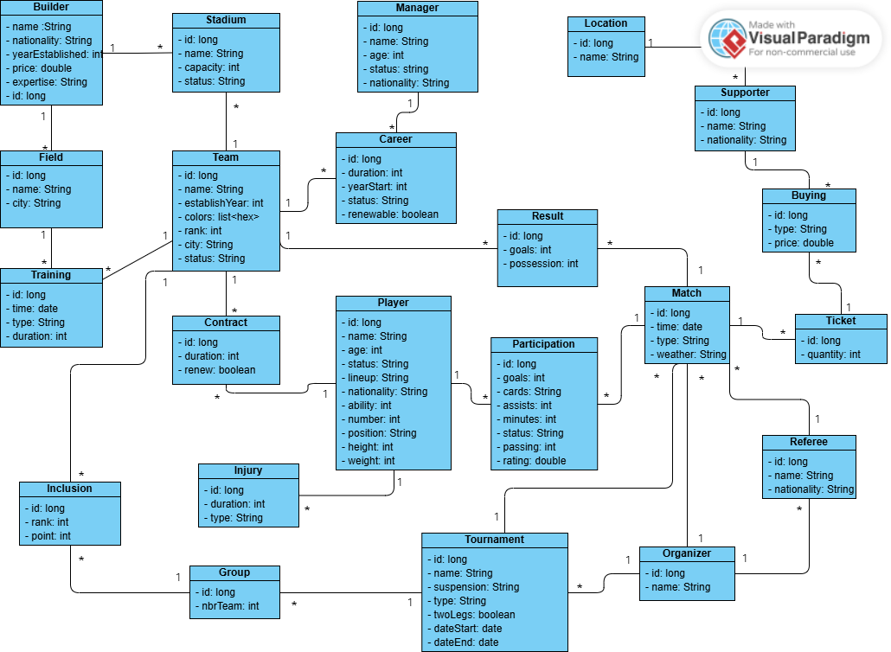

# Football tournaments management Application - Backend 🌍
-----------------------------------------------------------
-----------------------------------------------------------

## Introduction
The aim of this project is to simulate the management of different football tournaments. It considers every part of each tournament starting from each team and its players and managers and going to supporters, stadiums buildes and organizers.

## Actors
Here are the main actors that will interact with the app:
- **Admin** : He manages the users of the application and he is able to manage also the locations.
- **Player** : He is able to check his performance, the upcoming matches, every tournament information and the next training sessions. He can also approve or refuse to make a transfer or to renew his contract with a team. And finally, he can announce his retirement.
- **Manager** : He can check his team and its players information. Moreover, he is able to check the upcoming matches, set the lineup, make training sessions and check the injuries. In the end, he can change his carer by looking for another team.
- **Organizer** : He can manage teams, tournaments and referees. He can also change the rules of each tournament or match.
- **Team** : The whole team will be represented by an actor from which they can manage their players, transfers and manager. They can also check the tournaments they belong to especially when there is a group stage. Finally, they can check their results and their schedule.
- **Builder** : He can build and manage difeerent stadiums and fields.

## Entities
This picture will represent the different entities that are present in this project:

## Technologies
Based on the complexity of the project, these are the choices for its development:
- **Springboot** : A framework for building Java-based microservices and applications efficiently.
- **Kafka** : A distributed messaging system for event streaming and real-time data pipelines.
- **MongoDB** : A NoSQL database for storing unstructured or semi-structured data as documents.
- **Postgresql** : A relational database management system for structured data with SQL support.
- **Zookeeper** : A centralized service for maintaining configuration, naming, and coordination for distributed systems.
- **Zipkin** : A distributed tracing system for monitoring and troubleshooting microservices.
- **Docker** : A containerization platform for packaging applications and their dependencies into portable containers.

## Architecture 
For this project, we adapted the microservices architecture for those reasons :

## Guide
